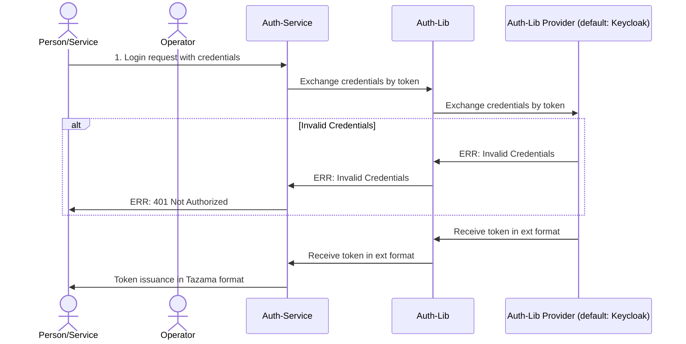

<!-- SPDX-License-Identifier: Apache-2.0 -->

# Auth-Service

<div align="center">

</div>

## Overview
Handles credential exchange for a token in Tazama.

### Setting Up

```sh
git clone https://github.com/tazama-lf/auth-service
cd auth-service
```
You then need to configure your environment: a [sample](.env.template) configuration file has been provided and you may adapt that to your environment. Copy it to `.env` and modify as needed:

```sh
cp .env.template .env
```
A [registry](https://github.com/tazama-lf/docs/blob/f3f5cf07425e9785c27531511601fc61a81e51e4/Research-Articles/Environment-Variables.md#current-environmental-variables-tazama-20-release) of environment variables is provided to provide more context for what each variable is used for.

#### Project Variables

| Variable | Purpose | Example
| ------ | ------ | ------ |
| `HOST` | Host IP to serve auth-service on | `0.0.0.0`
| `PORT` | Port to serve on | `3020`
| `AUTH_PROVIDER` | Package name of Auh-lib provider for auth-service to use | `@tazama-lf/auth-lib-provider-keycloak`

#### Auth-Lib Variables

| Variable | Purpose | Example
| ------ | ------ | ------ |
| `CERT_PATH_PRIVATE` | The file path to the pem certificate for signing Tazama tokens | `/path/to/private-key.pem`

#### Auth-Lib Provider Variables
*These will change if a different provider is installed and the AUTH_PROVIDER is changed*

**Provider: @tazama-lf/auth-lib-provider-keycloak**

| Variable | Purpose | Example
| ------ | ------ | ------ |
| `AUTH_URL` | Base URL where KeyCloak is hosted | `https://keycloak.example.com:8080`
| `KEYCLOAK_REALM` | KeyCloak Realm for Tazama | `tazama`
| `CLIENT_ID` | KeyCloak defined client for auth-lib | `auth-lib-client`
| `CLIENT_SECRET` | The secret of the KeyCloak client | `someClientGeneratedSecret123`

#### Build and Start

```sh
npm i
npm run build
npm run start
```

## API

### 1. Auth Login

#### Description

Login using Username and Password to receive a Tazama token.

#### Request

- **Method:** POST
- **URL:** `/v1/auth/login`
- **Headers:** 
  - `Content-Type: application/json`
- **Body:**
``` JSON
{
    "username": "testUser",
    "password": "testUserPassword"
}
```

#### Response

- **Status Code:** 200 OK
- **Content-Type:** application/json
- **Body:**
```
eyJhbGciOiJSUz...ukUfoow
```

## Internal Process Flow

### Sequence Diagram


## Troubleshooting
### npm install
Ensure generated token has read package rights

### npm build
Ensure that you're on the current LTS version of Node.JS

### tazama authentication library
Ensure **@tazama-lf/auth-lib** is installed with an accompanying auth-lib-provider (**@tazama-lf/auth-lib-provider-keycloak**)
